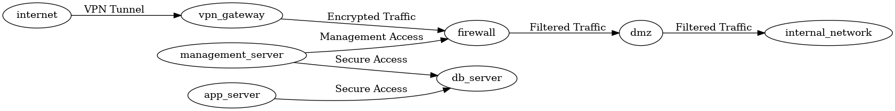
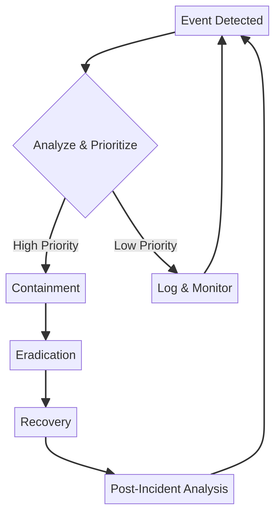

# Security Architecture and Workflow Diagrams

This section provides visual representations of secure network architectures and common security workflows. These diagrams are intended to help users understand the structural and procedural aspects of server security.

## 📊 Available Diagrams

### 1. Secure Network Architecture

This diagram illustrates a basic secure network architecture, featuring a DMZ for public-facing servers and an internal network for sensitive database and management systems, all protected by firewalls and VPN gateways.

### 2. Security Incident Response Workflow

This workflow diagram outlines the key phases of responding to a security incident, from initial detection and analysis to containment, eradication, recovery, and post-incident analysis.

## 🛠️ Tools Used

These diagrams were created using [D2](https://d2lang.com/) and [Mermaid](https://mermaid.js.org/).
