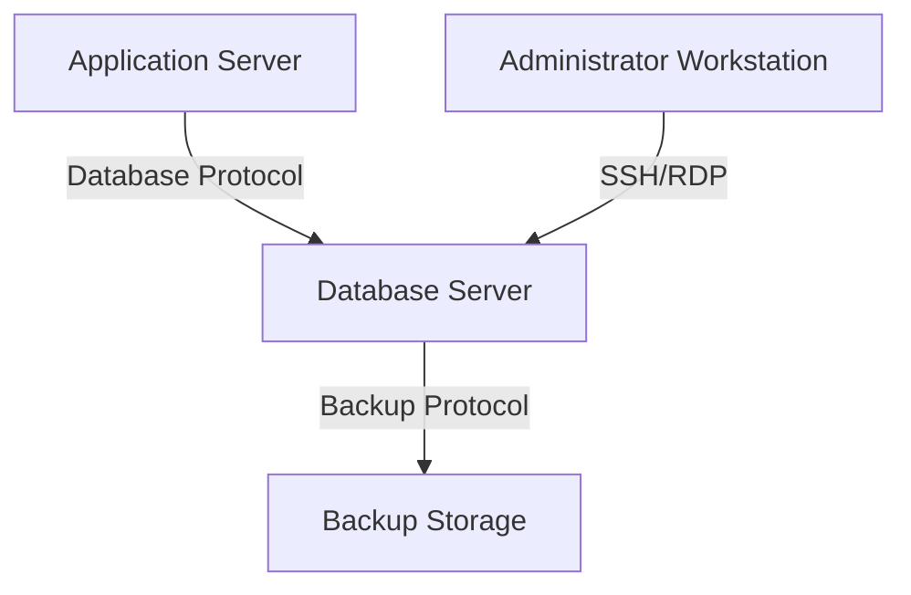

# 02 - Database Server Threat Model

This document outlines a threat model for a typical database server, focusing on potential threats, vulnerabilities, and countermeasures using the STRIDE methodology.

## 1. System Description

A database server stores and manages critical application data. It typically resides in a highly restricted network segment, accessible only by application servers and authorized administrators. Common database systems include MySQL, PostgreSQL, SQL Server, Oracle, and MongoDB.

## 2. Data Flow Diagram (DFD) - Simplified

## 3. Asset Identification

*   **Data**: Sensitive customer data, financial records, intellectual property, application configuration, user credentials, audit logs.
*   **Services**: Database engine, administrative interfaces, backup services.
*   **Infrastructure**: Server OS, storage, network connectivity.

## 4. Threat Analysis (STRIDE)

### 4.1. Spoofing (Identity Spoofing)

**Threat**: An attacker impersonates a legitimate application server, administrator, or database user.

**Examples**:
*   Compromised application server connecting to the database as a legitimate application.
*   Attacker gaining access to database credentials.
*   SQL injection to bypass authentication.

**Vulnerabilities**:
*   Weak database user authentication.
*   Shared database credentials among multiple applications.
*   Lack of network-level authentication for database connections.

**Countermeasures**:
*   Use strong, unique passwords for all database accounts.
*   Implement Multi-Factor Authentication (MFA) for database administrators.
*   Use application-specific database users with minimal privileges.
*   Implement client certificate authentication or mutual TLS for database connections.
*   Regularly rotate database credentials.

### 4.2. Tampering (Data Tampering)

**Threat**: An attacker modifies data stored in the database or in transit to/from the database.

**Examples**:
*   SQL Injection leading to unauthorized data modification or deletion.
*   Direct access to database files on the server to alter data.
*   Modification of database configuration files.

**Vulnerabilities**:
*   Vulnerable application code allowing SQL injection.
*   Insecure file permissions on database files and configuration.
*   Lack of integrity checks for data in storage or transit.

**Countermeasures**:
*   Use parameterized queries and stored procedures to prevent SQL Injection.
*   Enforce strict file permissions on database directories and files.
*   Utilize encryption for data in transit (e.g., TLS for database connections).
*   Implement database auditing to detect unauthorized data changes.
*   Regularly backup databases and verify integrity.

### 4.3. Repudiation (Non-Repudiation)

**Threat**: A user or system entity denies having performed an action within the database.

**Examples**:
*   A database administrator denies executing a specific query.
*   An application denies writing certain data to the database.

**Vulnerabilities**:
*   Insufficient logging of database activities.
*   Lack of audit trails for administrative actions.

**Countermeasures**:
*   Enable comprehensive database auditing for all critical operations (e.g., DDL, DML, user logins).
*   Ensure audit logs are immutable, stored securely, and regularly reviewed (e.g., centralized SIEM).
*   Implement strong authentication and authorization to link actions to specific identities.

### 4.4. Information Disclosure

**Threat**: Sensitive data from the database is exposed to unauthorized individuals.

**Examples**:
*   SQL Injection leading to data exfiltration.
*   Unencrypted database backups being accessed.
*   Verbose error messages revealing database schema or sensitive information.
*   Direct access to database files on the server.

**Vulnerabilities**:
*   Vulnerable application code.
*   Lack of encryption for data at rest and in transit.
*   Insecure backup storage.
*   Misconfigured database error reporting.

**Countermeasures**:
*   Encrypt sensitive data at rest (e.g., Transparent Data Encryption, column-level encryption).
*   Encrypt all database backups.
*   Encrypt data in transit using TLS/SSL for all database connections.
*   Implement robust access controls to database files and directories.
*   Configure database error messages to be generic and log details internally.

### 4.5. Denial of Service (DoS)

**Threat**: An attacker prevents legitimate users or applications from accessing the database.

**Examples**:
*   SQL queries designed to consume excessive database resources.
*   DDoS attacks targeting the database server directly.
*   Exploiting vulnerabilities that cause the database service to crash.
*   Resource exhaustion due to unoptimized queries or insufficient server resources.

**Vulnerabilities**:
*   Inefficient database queries or lack of proper indexing.
*   Unpatched database software with known DoS vulnerabilities.
*   Lack of resource limits for database users or connections.

**Countermeasures**:
*   Optimize database queries and ensure proper indexing.
*   Regularly patch and update database software.
*   Implement resource governance (e.g., connection limits, query timeouts).
*   Monitor database performance and resource utilization.
*   Implement network-level protections (e.g., firewalls, IDS/IPS) to filter malicious traffic.

### 4.6. Elevation of Privilege

**Threat**: An attacker gains higher privileges within the database or on the database server than they are authorized for.

**Examples**:
*   Exploiting a vulnerability in the database engine to gain `sysadmin` or `root` privileges.
*   Insecure database configuration allowing a low-privileged user to execute administrative commands.
*   Compromise of an application server leading to full database access.

**Vulnerabilities**:
*   Unpatched database software.
*   Over-privileged database users or application accounts.
*   Weak access controls on the database server OS.

**Countermeasures**:
*   Implement the Principle of Least Privilege for all database users and application accounts.
*   Regularly patch and update database software and the underlying operating system.
*   Restrict direct access to the database server OS to authorized administrators only.
*   Use database roles and granular permissions to control access to specific tables, views, and procedures.
*   Conduct regular security audits and penetration testing.

## 5. References

*   [OWASP Cheat Sheet Series - SQL Injection Prevention](https://cheatsheetseries.owasp.org/cheatsheets/SQL_Injection_Prevention_Cheat_Sheet.html)
*   [NIST SP 800-115 - Technical Guide to Information Security Testing and Assessment](https://nvlpubs.nist.gov/nistpubs/Legacy/SP/nistspecialpublication800-115.pdf)
