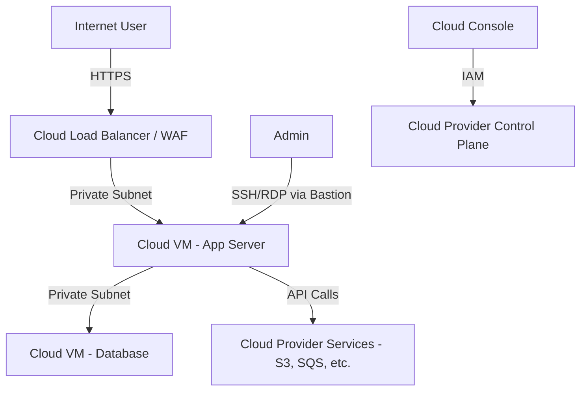

# 03 - Cloud Server Threat Model

This document outlines a threat model for a cloud-based server deployment (e.g., EC2, Azure VM, GCP Compute Engine), using the STRIDE methodology.

## 1. System Description

A cloud server is a virtual machine running in a public cloud provider's infrastructure. It hosts applications or services accessible over the internet or private networks. The cloud provider manages the physical infrastructure, hypervisor, and network fabric, while the customer manages the OS, applications, and data.

## 2. Data Flow Diagram (DFD)

## 3. Asset Identification

| Asset | Description | Sensitivity |
|-------|-------------|-------------|
| Cloud VM instances | Running application workloads | High |
| Cloud storage (S3/Blob/GCS) | Data at rest | High |
| IAM credentials | Access keys, service accounts | Critical |
| VPC/Network config | Security groups, NACLs, routing | High |
| API keys / Secrets | Third-party service credentials | Critical |
| Cloud control plane | Management APIs | Critical |
| Snapshots / Backups | Recovery data | High |

## 4. Threat Analysis (STRIDE)

### 4.1. Spoofing

**Threat**: Attacker gains access using stolen IAM credentials or compromised service accounts.

| Vulnerability | Countermeasure |
|---------------|----------------|
| Long-lived access keys | Use IAM roles, short-lived tokens (STS), avoid static keys |
| Weak MFA on cloud accounts | Enforce hardware MFA on all IAM users, especially root |
| Shared credentials across services | Use dedicated service accounts with least privilege |
| No identity federation | Use SSO/identity federation (SAML/OIDC) for human access |

### 4.2. Tampering

**Threat**: Attacker modifies cloud configurations, VM images, or stored data.

| Vulnerability | Countermeasure |
|---------------|----------------|
| Misconfigured IAM allowing config changes | Use IAM Condition keys, SCPs to restrict region/service |
| No infrastructure-as-code audit trail | Use CloudTrail/Azure Activity Log/GCP Audit Logs |
| Unsigned VM images | Use image signing and verified boot |
| Unprotected storage buckets | Enable S3 Block Public Access, use bucket policies |

### 4.3. Repudiation

**Threat**: Attacker performs actions without accountability.

| Vulnerability | Countermeasure |
|---------------|----------------|
| Logging disabled or insufficient | Enable CloudTrail/Azure Monitor/GCP Cloud Audit Logs |
| Logs not centrally stored | Ship logs to SIEM, use immutable log storage |
| No API call logging | Enable logging for all management plane operations |
| Log tampering possible | Use log integrity validation (e.g., digest files) |

### 4.4. Information Disclosure

**Threat**: Sensitive data exposed through misconfigurations or breaches.

| Vulnerability | Countermeasure |
|---------------|----------------|
| Public S3 buckets / storage accounts | Block public access, audit with AWS Config / Azure Policy |
| Unencrypted data at rest | Enable encryption (SSE-S3, SSE-KMS, CMK) |
| Unencrypted data in transit | Enforce TLS 1.2+ for all connections |
| Metadata service accessible from containers | Enforce IMDSv2, restrict metadata access |
| Secrets in environment variables | Use managed secret stores (Vault, Secrets Manager) |

### 4.5. Denial of Service

**Threat**: Cloud resources overwhelmed, causing service outage.

| Vulnerability | Countermeasure |
|---------------|----------------|
| No DDoS protection | Enable AWS Shield / Azure DDoS Protection / Cloud Armor |
| No rate limiting on APIs | Use API gateway rate limiting |
| Single-region deployment | Deploy across multiple AZs/regions |
| No auto-scaling | Configure auto-scaling groups with limits |
| Resource exhaustion (crypto mining) | Monitor CPU usage, use GuardDuty/Defender |

### 4.6. Elevation of Privilege

**Threat**: Attacker escalates from low-privilege access to admin.

| Vulnerability | Countermeasure |
|---------------|----------------|
| Overly permissive IAM policies | Audit with IAM Access Analyzer, use least privilege |
| IMDSv1 allowing SSRF-based credential theft | Enforce IMDSv2, limit hop limit |
| No privilege boundary | Use IAM Permission Boundaries, SCPs |
| Console access from untrusted networks | Restrict console access via IP, use VPN |

## 5. Risk Matrix

| Threat | Likelihood | Impact | Risk | Priority |
|--------|-----------|--------|------|----------|
| IAM credential theft | High | Critical | Critical | 1 |
| Public storage exposure | Medium | Critical | High | 2 |
| DDoS attack | Medium | High | High | 3 |
| Misconfigured security groups | Medium | High | High | 4 |
| Unencrypted data | Low | Critical | Medium | 5 |
| Supply chain (malicious AMI) | Low | Critical | Medium | 6 |

## 6. Recommendations

1. **Enable CloudTrail/Audit Logs** for all regions and services
2. **Enforce MFA** on all human IAM users, disable root access keys
3. **Use IAM roles** instead of static access keys for workloads
4. **Enable encryption** at rest and in transit for all data stores
5. **Block public access** on all storage by default
6. **Enable DDoS protection** (Shield Standard is free)
7. **Use security groups** with least-privilege rules
8. **Scan for misconfigurations** with CSPM tools (Security Hub, Defender for Cloud)
9. **Monitor for anomalous activity** with GuardDuty/Defender for Cloud
10. **Test incident response** — know how to revoke credentials and isolate resources quickly

## 7. References

*   [NIST SP 800-144 - Guidelines on Cloud Security](https://nvlpubs.nist.gov/nistpubs/Legacy/SP/nistspecialpublication800-144.pdf)
*   [AWS Well-Architected Framework - Security Pillar](https://docs.aws.amazon.com/wellarchitected/latest/security-pillar/security-pillar.html)
*   [CIS Cloud Benchmarks](https://www.cisecurity.org/benchmark/)
