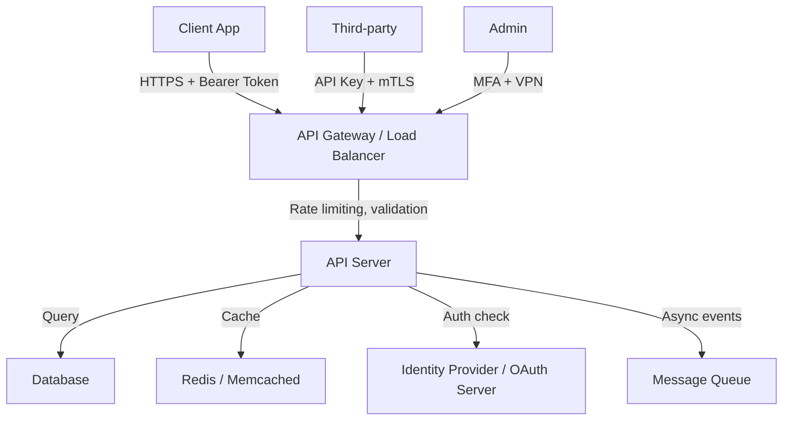

# 04 - API Threat Model

This document outlines a threat model for a RESTful API service, using the STRIDE methodology. APIs are a primary attack surface in modern applications.

## 1. System Description

A RESTful API service exposes endpoints for client applications (web, mobile, third-party integrations) to create, read, update, and delete resources. The API typically authenticates users via OAuth 2.0/JWT tokens, validates authorization, and communicates with backend services and databases.

## 2. Data Flow Diagram (DFD)

## 3. Asset Identification

| Asset | Description | Sensitivity |
|-------|-------------|-------------|
| API endpoints | Business logic, data access | High |
| Authentication tokens | JWT, API keys, OAuth tokens | Critical |
| User data | PII, financial, health records | Critical |
| Backend databases | Persistent data store | Critical |
| API keys / Secrets | Third-party credentials | Critical |
| Rate limiting config | Abuse prevention | Medium |
| API schema / OpenAPI spec | Implementation details | Medium |

## 4. Threat Analysis (STRIDE)

### 4.1. Spoofing

**Threat**: Attacker impersonates a legitimate API client or user.

| Vulnerability | Countermeasure |
|---------------|----------------|
| Weak or missing authentication | Require OAuth 2.0/OIDC for all endpoints |
| Static API keys without rotation | Rotate keys regularly, use short-lived tokens |
| No mTLS for service-to-service | Implement mutual TLS for internal API calls |
| Token replay attacks | Use short expiry, refresh tokens, token binding |
| No client certificate validation | Validate client certs in mTLS configurations |

### 4.2. Tampering

**Threat**: Attacker modifies API requests or responses.

| Vulnerability | Countermeasure |
|---------------|----------------|
| No input validation | Validate all inputs against OpenAPI schema |
| Mass assignment | Whitelist allowed fields, reject unexpected properties |
| No request signing | Sign requests with HMAC for sensitive operations |
| Response manipulation | Use consistent response formats, validate output |
| Parameter pollution | Validate and normalize all query/body parameters |

### 4.3. Repudiation

**Threat**: Attacker performs API actions without audit trail.

| Vulnerability | Countermeasure |
|---------------|----------------|
| No API request logging | Log all requests with request ID, user ID, timestamp |
| Logs don't capture authorization decisions | Log both allow and deny decisions |
| No immutable audit trail | Ship logs to immutable storage (S3 with Object Lock) |
| Admin actions not logged | Log all administrative API calls separately |

### 4.4. Information Disclosure

**Threat**: Sensitive data exposed through API responses or errors.

| Vulnerability | Countermeasure |
|---------------|----------------|
| Verbose error messages (stack traces) | Return generic errors, log details server-side |
| Excessive data in responses | Implement field filtering, return only needed data |
| API documentation publicly accessible | Restrict docs to authenticated users |
| Version headers / server banners | Remove or minimize server identification headers |
| Leaking internal IDs / secrets | Use external-facing IDs, never expose internal state |

### 4.5. Denial of Service

**Threat**: API overwhelmed with requests.

| Vulnerability | Countermeasure |
|---------------|----------------|
| No rate limiting | Implement per-client, per-endpoint rate limits |
| No request size limits | Enforce body size limits at gateway |
| Expensive query endpoints | Add query complexity limits, pagination |
| No timeout configuration | Set connection and read timeouts |
| Resource exhaustion (large payloads) | Validate and limit upload sizes |

### 4.6. Elevation of Privilege

**Threat**: Attacker accesses resources they shouldn't.

| Vulnerability | Countermeasure |
|---------------|----------------|
| Broken Object Level Authorization (BOLA) | Validate object ownership on every request |
| Missing scope checks | Enforce OAuth scopes per endpoint |
| IDOR (Insecure Direct Object References) | Use indirect references, validate permissions |
| No tenant isolation | Validate tenant context on every multi-tenant request |
| Privilege escalation via API | Restrict admin endpoints, require step-up auth |

## 5. OWASP API Security Top 10 Mapping

| OWASP Risk | STRIDE Category | Key Countermeasure |
|------------|-----------------|-------------------|
| API1: Broken Object Level Authorization | Elevation of Privilege | Validate object ownership per request |
| API2: Broken Authentication | Spoofing | Use OAuth 2.0, enforce MFA, rotate tokens |
| API3: Broken Object Property Level Authorization | Tampering / Info Disclosure | Whitelist allowed fields per role |
| API4: Unrestricted Resource Consumption | Denial of Service | Rate limiting, pagination, query limits |
| API5: Broken Function Level Authorization | Elevation of Privilege | Enforce authorization per endpoint |
| API6: Unrestricted Access to Sensitive Flows | Elevation of Privilege | Bot protection, step-up auth for sensitive ops |
| API7: Server-Side Request Forgery (SSRF) | Tampering | Validate and sanitize URLs, block internal ranges |
| API8: Security Misconfiguration | Info Disclosure | Disable debug, remove defaults, harden headers |
| API9: Improper Inventory Management | All | Maintain API inventory, deprecate old versions |
| API10: Unsafe Consumption of APIs | Tampering | Validate third-party API responses, timeout |

## 6. Recommendations

1. **Authenticate every request** — no unauthenticated endpoints
2. **Validate object-level authorization** on every resource access (BOLA is #1 risk)
3. **Rate limit aggressively** — per client, per endpoint, per tenant
4. **Validate and sanitize all inputs** against the OpenAPI schema
5. **Minimize data exposure** — return only fields the client needs
6. **Log everything** — request ID, user ID, decision, timestamp
7. **Use short-lived tokens** — JWT expiry ≤ 15 minutes, refresh tokens
8. **Implement mTLS** for service-to-service communication
9. **Maintain an API inventory** — track all versions, deprecate old ones
10. **Scan for vulnerabilities** — add SAST/DAST to CI/CD for API endpoints

## 7. References

*   [OWASP API Security Top 10](https://owasp.org/API-Security/)
*   [NIST SP 800-204A - Security for Microservices](https://csrc.nist.gov/publications/detail/sp/800-204a/final)
*   [MITRE ATT&CK - Web Service](https://attack.mitre.org/techniques/T1593/)
