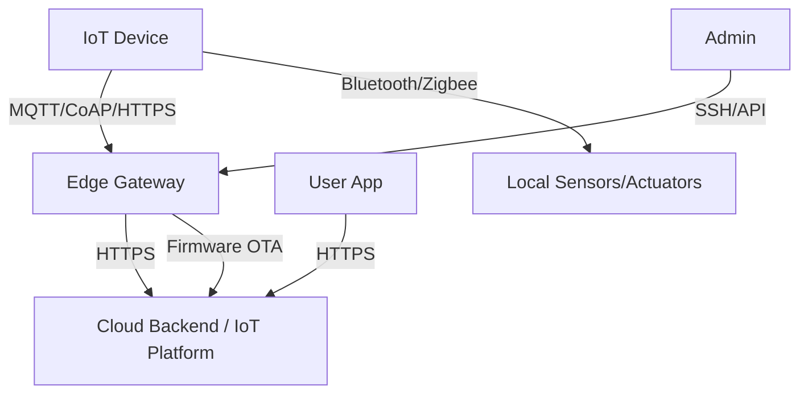

# 05 - IoT / Edge Device Threat Model

This document outlines a threat model for IoT and edge devices (smart cameras, sensors, gateways, industrial controllers), using the STRIDE methodology. IoT devices have unique constraints: limited compute, long lifespans, and physical accessibility.

## 1. System Description

An IoT deployment consists of resource-constrained devices that collect data, communicate with a cloud backend or edge gateway, and may act on local actuators. Communication typically uses MQTT, CoAP, or HTTP over Wi-Fi, Bluetooth, Zigbee, or cellular networks.

## 2. Data Flow Diagram (DFD)

## 3. Asset Identification

| Asset | Description | Sensitivity |
|-------|-------------|-------------|
| Device firmware | Operating code on the device | Critical |
| Device identity / credentials | Certificates, keys, tokens | Critical |
| Sensor data | Environmental, health, location | High |
| Actuator controls | Locks, valves, motors, relays | Critical |
| Communication channel | MQTT/CoAP messages in transit | High |
| Cloud backend | Data aggregation, management | Critical |
| OTA update mechanism | Firmware delivery pipeline | Critical |
| Physical device | Hardware, ports, debug interfaces | High |

## 4. Threat Analysis (STRIDE)

### 4.1. Spoofing

**Threat**: Attacker impersonates a legitimate device or gateway.

| Vulnerability | Countermeasure |
|---------------|----------------|
| Default or shared device credentials | Unique per-device credentials, provisioned at factory |
| No device identity verification | Use X.509 client certificates per device |
| Weak MQTT authentication | Require MQTT v5 with username/password or cert auth |
| Rogue gateway impersonation | Mutual TLS between device and gateway |
| No mutual authentication | Implement mTLS on both sides of every connection |

### 4.2. Tampering

**Threat**: Attacker modifies device firmware, data, or configuration.

| Vulnerability | Countermeasure |
|---------------|----------------|
| Unsigned firmware updates | Sign all OTA updates, verify signatures on device |
| No secure boot | Enable secure boot chain (hardware root of trust) |
| Modifiable configuration | Store config in secure element / TPM |
| No firmware integrity check | Verify hash of firmware before boot |
| Flash memory accessible via debug ports | Disable JTAG/UART in production, fuse debug ports |

### 4.3. Repudiation

**Threat**: Device actions cannot be attributed or audited.

| Vulnerability | Countermeasure |
|---------------|----------------|
| No device-level logging | Log critical events locally (boot, config changes, commands) |
| No message signing | Sign MQTT messages with device key |
| Logs only on cloud (lost if device offline) | Buffer logs locally, sync when connected |
| No audit trail for firmware updates | Log OTA update attempts with version and result |

### 4.4. Information Disclosure

**Threat**: Sensitive data exposed through device or communication.

| Vulnerability | Countermeasure |
|---------------|----------------|
| Unencrypted communication (MQTT without TLS) | Use TLS 1.2+ for all device communication |
| Credentials stored in plaintext | Store in secure element / encrypted partition |
| Debug interfaces left open | Disable UART, JTAG, SWD in production |
| Excessive data collection | Collect only necessary data, minimize retention |
| Device telemetry leaks location | Anonymize or minimize location data |

### 4.5. Denial of Service

**Threat**: Device or network overwhelmed.

| Vulnerability | Countermeasure |
|---------------|----------------|
| No message rate limiting | Implement per-device rate limiting at gateway |
| Resource exhaustion (memory/CPU) | Set resource limits, watchdog timer |
| Network flooding | Use QoS levels in MQTT, prioritize critical messages |
| OTA update bricking devices | Use A/B partition scheme, rollback on failure |
| Power exhaustion attacks | Implement power management, deep sleep modes |

### 4.6. Elevation of Privilege

**Threat**: Attacker gains control of device or actuator.

| Vulnerability | Countermeasure |
|---------------|----------------|
| Default admin passwords | Force password change on first use |
| No privilege separation | Run services with minimal permissions |
| Overly permissive MQTT topics | Use topic-level ACLs (e.g., `device/123/cmd` only) |
| Physical access to device | Tamper-evident enclosure, secure boot |
| Firmware update to malicious version | Code signing, rollback protection |

## 5. Risk Matrix

| Threat | Likelihood | Impact | Risk | Priority |
|--------|-----------|--------|------|----------|
| Default/weak credentials | High | Critical | Critical | 1 |
| Unsigned firmware (OTA compromise) | Medium | Critical | High | 2 |
| Unencrypted communication | High | High | High | 3 |
| Physical access / debug ports | Medium | High | High | 4 |
| Rogue device on network | Medium | High | High | 5 |
| Device tampering (sensor spoofing) | Low | High | Medium | 6 |

## 6. Recommendations

1. **Unique per-device identity** — never share credentials across devices
2. **Use hardware roots of trust** — TPM, secure element, or HSM for key storage
3. **Sign all firmware** — verify signatures before and during boot
4. **Encrypt all communication** — TLS 1.2+ for every connection
5. **Disable debug interfaces** — fuse JTAG/UART in production firmware
6. **Implement secure boot** — verify firmware integrity at every boot
7. **Use A/B partitions** — enable rollback if OTA update fails
8. **Rate limit at gateway** — prevent device flooding
9. **Monitor device health** — detect offline/unexpected-behaving devices
10. **Plan for device end-of-life** — certificate rotation, key revocation, decommissioning

## 7. References

*   [NIST IR 8259 - IoT Device Cybersecurity Guidance](https://csrc.nist.gov/publications/detail/nistir/8259/final)
*   [OWASP IoT Top 10](https://owasp.org/www-project-internet-of-things/)
*   [ETSI EN 303 645 - IoT Security](https://www.etsi.org/deliver/etsi_en/303600_303699/303645/)
